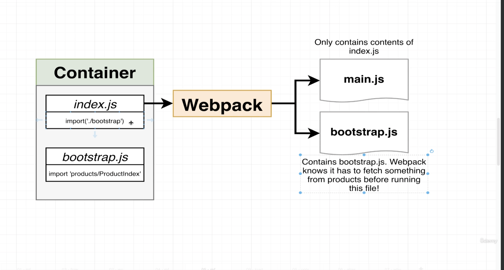
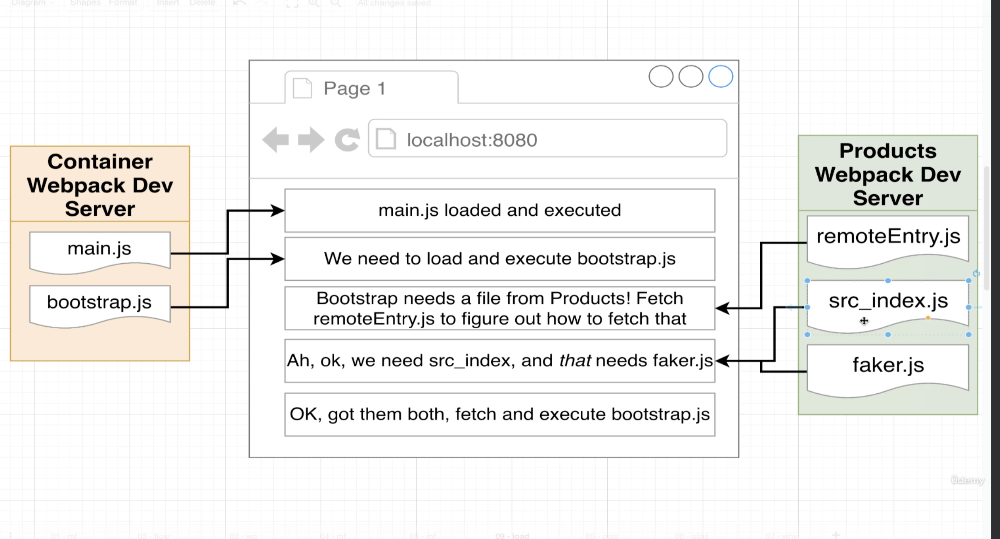

# Container MFE setup

# Basic Architecture

- giving an opertunity to webpack inside the browser to go ahead and fetch some dependencies from the products before actually executing the code from bootstrap.
- Below code shows the order in which the files get executed. 

- From the above screenshot we can notice that browser executes main.js first which intearn imports bootstrap.js---> bootstrap.js has a products code that needs to be fetched from a products MFE. It goes and fetches remoteEntry.js tells webpack that in order to run the bootstrap.js we need to fetch the src_index and faker.js ----> remoteEntry.js tells where to fetch the src_index and faker.js
- Once it has all the files needed to run the bootstrap. It runs the bootstrap