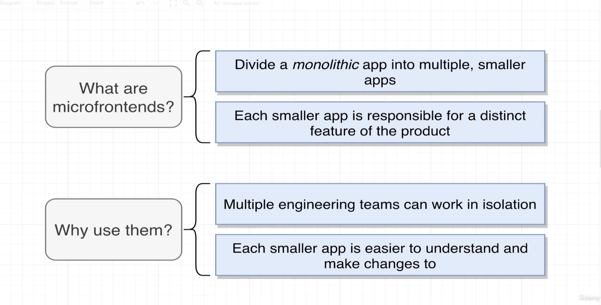
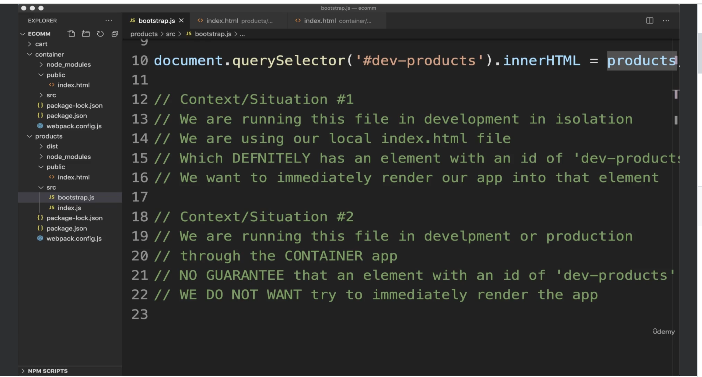

# Micro Frontend


# Webpack
- It transforms multiple input JS file into a single js file, which we typically called as bundle. This file is then 
- passed on to the browser to get executed. To execute the file on to the browser we need to configure webpack with devServer. It is a 
- property on a webpack config object which accepts an object with port and other properties. We need to set a port here to execute the output
- generated by webpack onto the browser. To make the webpack devServer enabled we need to run npm run webpack serve
- current webpack configuration would look something like below
```
module.exports = {
    mode: "development",
    devServer: {
        port: 8081
    }
}
```
- When we run the command npm run webpack serve. Following things happen
    - webpack creates the bundler out JS files. The output generated by webpack can be accessed on http://localhost:8081/main.js. However, just this piece of code/(contents of bundle) is of no use for us. It would be of some use if we could run this code. That can be atcheived by injecting it into html file. 
    - To run this we need to create a html document and reference this using stript tag. 
    - We create a simple html file inside src/index.html and add the following code
    ```
    <!Document html>
    <html>
    <head>
    </head>
    <body>
    </body>
    </html>
    ```
    - If you notice we have not added any script tag. We expect webpack to figure out how to add it. Expectation is eventualy we need to be able to see the script tag with reference to main.js inside the index.html somthing as below
    ```
    <scrpit src="main.js"></script>
    ```
    - When working with lage projects webpack may provide more than one js file with unpredicted names. This becomes dificult to keep track of them and inject into html. To over come this we have a plugin called HtmlWebpackPlugin. It can be used to configure the app to load html and add appropriate script tags to it
    - Below webpack config file shows how to configure the webpack to map the names of output files generated by webpack to the script tag in html file
    ```
    const HtmlWebpackPlugin = require('html-webpack-plugin')
    module.exports = {
        mode: 'development',
        devServer: {
            port: 8081
        },
        plugins:[
            new HtmlWebpackPlugin({
                template: './public/index.html'
            })
        ]
    }
    ```
    - With the above webpack configuration we are able to acheive following things
        - able to inject the webpack outbput bundler into the html file and execute the code in browser
        - now we want to make this code accessable to external apps. How do we acheive it? We can use ModuleFederationPlugin provided by webpack. below is the code snippet to acheive it
        ```
        const HtmlWebpackPlugin = require('html-webpack-plugin');
        const ModuleFederationPlugin = require('webpack/lib/container/ModuleFederationPlugin');
        module.exports = {
            mode: "development",
            devServer:{
                port: 8081
            },
            plugins: [
                new HtmlWebpackPlugin({
                    template: './src/index.html'
                }),
                new ModuleFederationPlugin({
                    name: "products",
                    filename: "remoteEntry.js",
                    exports: {
                        './ProductIndex': "./src/index"
                    }
                })
            ]
        }

        ```
        - Above code does the following
            - Emits a noraml main.js (bundler) seperately
            - ModuleFederationPlugin emits remoteEntry.js, src_index.js, faker.js. 
            - remoteEntry.js file contains a list of files that are available from this project and directions on how to load them
            - version of src_index.js and faker.js files that are transformed by webpack and are ready to execute safly by browser. remote.Entry has all the information about how to execute them.
            - when we look at the src_index.js file outputed by the webpack. It looks similar to our index.js with some webpack code added to it which helps in importing the dependencies required to run the index.js
            - ModuleFederation Plugin spits out few files with instructions on how other projects can get access to the source code of the products.
        
- Sub-App Execution context
    - Main goal of microfrontend is to run it in isolation. Each microfrotend has and html and index.js file. When a microfrontend is run in development mode, html should be loaded on to browser, when run in production it should not.
    - In index.js file in products app we generate some html code and try to render it by passing it into html using some random id selector. However, this may be fine for the products team who is working on it. When the same file is consumed by the container, it doesn't work. To overcome this we need to come up with a solution to make it dynamic. The container team is completely a seperate team that might not have a div element expected by the procuct app index.js and might cause an issue. They might have an html with different Id. Product team will not have access to the html file of the container team. 
    This might lead to a bog problem. Container team can't ensure or guarentee that some id that product team expects. 
    